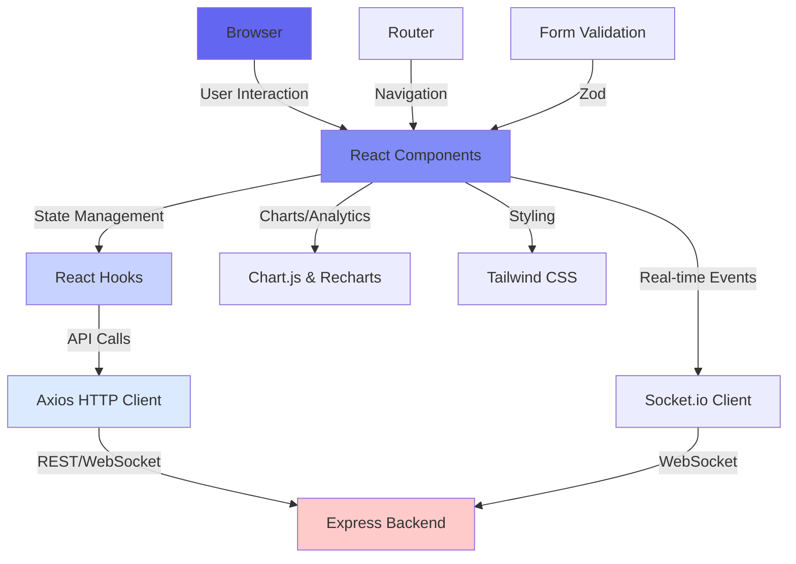
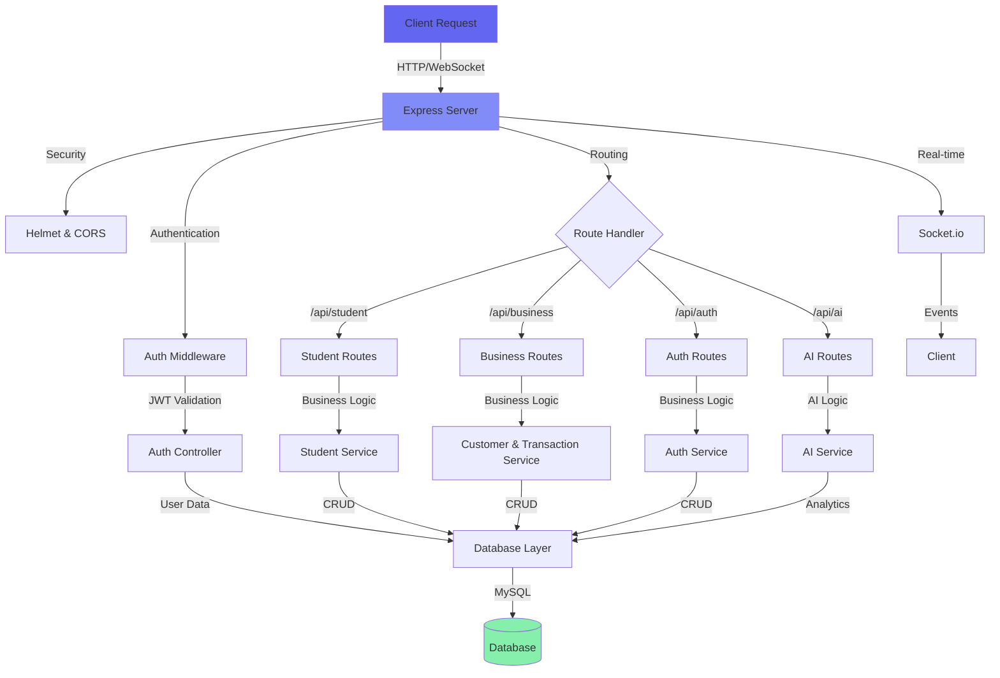
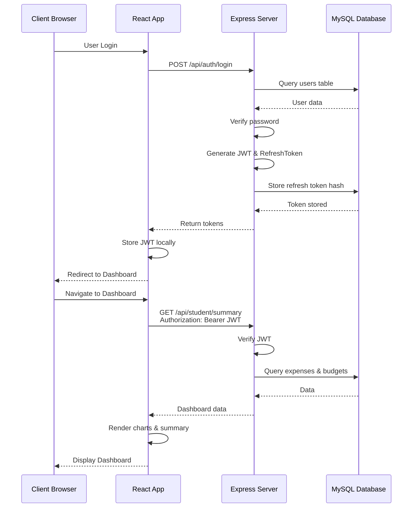

# 📊 HisabKitab – AI Smart Expense Tracker & Business Ledger System

<div align="center">

[](https://react.dev)
[](https://nodejs.org)
[](https://expressjs.com)
[](https://www.mysql.com)
[](https://jwt.io)
[](LICENSE)

A powerful dual-mode financial management system for both students and businesses with AI-powered insights, real-time updates, and comprehensive reporting.

[🌐 Live Demo](https://smart-expense-tracker-sage.vercel.app) • [📧 Contact](#author)

</div>

---

## 📋 Table of Contents

- [Project Overview](#project-overview)
- [Features](#features)
- [Tech Stack](#tech-stack)
- [Project Structure](#project-structure)
- [Installation](#installation)
- [Environment Variables](#environment-variables)
- [API Endpoints](#api-endpoints)
- [Database Schema](#database-schema)
- [Authentication](#authentication)
- [Project Architecture](#project-architecture)
- [Development](#development)
- [Future Improvements](#future-improvements)
- [Contributing](#contributing)
- [License](#license)
- [Author](#author)

---

## 🎯 Project Overview

**HisabKitab** is a comprehensive financial management platform designed to serve two distinct user personas:

### 🎓 **Student Mode**
Personal expense tracking with budget management, spending analytics, and intelligent insights to help students manage their finances efficiently.

### 💼 **Business Mode**
A professional digital ledger system for small businesses and retailers to manage customer credit/debit transactions, generate reports, and maintain detailed transaction histories.

### Why HisabKitab?
- **Dual-mode system**: Tailored solutions for students and business owners
- **Real-time updates**: Socket.io integration for instant data synchronization
- **AI-powered insights**: Intelligent recommendations based on spending/transaction patterns
- **Secure & scalable**: JWT-based authentication with role-based access control
- **Professional reporting**: PDF generation for invoices and transaction reports
- **Mobile-friendly**: Responsive design that works on all devices

---

## ✨ Features

### 🎓 Student Module

- ✅ **User Authentication**: Secure registration, login, and password recovery
- ✅ **Expense Tracking**: Quick expense logging with categorization
- ✅ **Budget Management**: Set and monitor monthly budgets
- ✅ **Dashboard**: Real-time overview of spending patterns
- ✅ **Expense Analytics**: Interactive charts and detailed expense breakdowns
- ✅ **Smart Alerts**: Budget overflow notifications and spending warnings
- ✅ **Category Management**: Custom expense categories
- ✅ **AI Insights**: Personalized spending recommendations and patterns
- ✅ **Profile Management**: Avatar upload and profile customization

### 💼 Business Module

- ✅ **Customer Management**: Add, update, and manage customer profiles with avatars
- ✅ **Ledger Management**: Maintain complete transaction history per customer
- ✅ **Credit/Debit Transactions**: Track customer payments and outstanding balances
- ✅ **Transaction Categorization**: Organize transactions by type and payment method
- ✅ **Payment History**: Complete audit trail with timestamps and payment methods
- ✅ **Dashboard & Analytics**: Real-time business metrics and financial overview
- ✅ **PDF Reports**: Generate customer statements and transaction reports
- ✅ **Payment Reminders**: Send payment reminders to customers
- ✅ **Backup System**: Automated backup creation and history tracking
- ✅ **AI Insights**: Business analytics and customer payment patterns
- ✅ **Customer Tags**: Tag and categorize customers (VIP, Regular, New, Inactive)
- ✅ **Avatar Management**: Customer profile pictures and visual identification

### 🔒 Security Features

- ✅ JWT-based authentication with token rotation
- ✅ Role-based access control (RBAC)
- ✅ Rate limiting on auth endpoints
- ✅ XSS protection and input sanitization
- ✅ CORS configured for secure cross-origin requests
- ✅ Helmet.js security headers
- ✅ MongoDB sanitization for SQL injection prevention
- ✅ Encrypted password storage with bcrypt

---

## 🛠️ Tech Stack

### **Frontend**
- **React 18.2.0** - Modern UI library
- **React Router v6** - Client-side routing
- **Tailwind CSS 3.3.6** - Utility-first CSS styling
- **Chart.js & React-Chartjs-2** - Interactive charts and graphs
- **Recharts 2.15.4** - Advanced charting library
- **React Hook Form 7.76.1** - Efficient form management
- **Zod 4.4.3** - Schema validation
- **Socket.io Client** - Real-time communication
- **Axios 1.6.0** - HTTP client
- **Lucide React** - Beautiful icon library
- **Framer Motion 10.18.0** - Smooth animations

### **Backend**
- **Node.js & Express 5.2.1** - Server framework
- **MySQL2 3.22.3** - Database driver
- **JWT 9.0.3** - Token-based authentication
- **Bcrypt 6.0.0** - Password hashing
- **Socket.io 4.8.3** - Real-time bidirectional communication
- **Puppeteer 25.0.4** - PDF generation
- **jsPDF 4.2.1** - PDF creation utility
- **Multer 2.1.1** - File upload handling
- **Nodemailer 8.0.7** - Email service
- **Twilio 4.19.0** - SMS notifications
- **Helmet 7.2.0** - Security headers
- **Express Rate Limit 7.5.1** - Rate limiting
- **Winston 3.19.0** - Logging

### **Database**
- **MySQL 8.0+** - Relational database
- **Stored Procedures** - Business logic optimization
- **Database Triggers** - Automatic balance updates
- **Views** - Simplified data querying

### **Development Tools**
- **Jest** - Testing framework
- **Supertest** - HTTP assertion library
- **Nodemon 3.1.14** - Auto-restart development server
- **ESLint & Prettier** - Code quality and formatting

---

## 📁 Project Structure

```
smart-expense-tracker/
│
├── frontend/                           # React application
│   ├── src/
│   │   ├── components/                # Reusable React components
│   │   ├── pages/                     # Page components (Dashboard, Login, etc)
│   │   ├── hooks/                     # Custom React hooks
│   │   ├── utils/                     # Utility functions and helpers
│   │   ├── App.jsx                    # Main app component
│   │   └── index.css                  # Global styles
│   ├── public/                        # Static assets
│   └── package.json                   # Frontend dependencies
│
├── backend/                            # Express application
│   ├── config/
│   │   └── db.js                      # Database connection
│   │
│   ├── controllers/                   # Business logic
│   │   ├── authController.js          # Authentication logic
│   │   ├── studentController.js       # Student operations
│   │   ├── businessController.js      # Business operations (via routes)
│   │   ├── customerController.js      # Customer management
│   │   ├── transactionController.js   # Transaction handling
│   │   ├── reportsController.js       # PDF & report generation
│   │   └── aiController.js            # AI insights
│   │
│   ├── routes/                        # API endpoints
│   │   ├── authRoutes.js              # /api/auth
│   │   ├── studentRoutes.js           # /api/student
│   │   ├── businessRoutes.js          # /api/business
│   │   └── aiRoutes.js                # /api/ai
│   │
│   ├── middleware/
│   │   ├── authMiddleware.js          # JWT verification
│   │   ├── roleMiddleware.js          # Role-based access control
│   │   ├── validationMiddleware.js    # Input validation
│   │   ├── securityMiddleware.js      # Security headers & rate limiting
│   │   ├── errorMiddleware.js         # Global error handling
│   │   ├── uploadMiddleware.js        # File upload configuration
│   │   └── customerOwnership.js       # Customer ownership verification
│   │
│   ├── services/                      # Business logic services
│   │   ├── customerService.js         # Customer operations
│   │   ├── transactionService.js      # Transaction logic
│   │   ├── authService.js             # Authentication service
│   │   ├── studentService.js          # Student operations
│   │   ├── aiService.js               # AI/ML operations
│   │   └── reportService.js           # Report generation
│   │
│   ├── utils/
│   │   ├── logger.js                  # Winston logger configuration
│   │   ├── responseHandler.js         # Standardized response format
│   │   ├── environment.js             # Environment validation
│   │   └── helpers.js                 # Utility functions
│   │
│   ├── constants/                     # Application constants
│   │   └── roles.js                   # Role definitions
│   │
│   ├── test/                          # Test files
│   │   ├── unit/                      # Unit tests
│   │   └── integration/               # Integration tests
│   │
│   ├── scripts/
│   │   └── add_indexes.js             # Database optimization
│   │
│   ├── public/                        # Static files & uploads
│   │   └── uploads/                   # User-uploaded files
│   │
│   ├── server.js                      # Express app initialization
│   ├── schema.sql                     # Database schema
│   ├── .env.example                   # Environment template
│   └── package.json                   # Backend dependencies
│
├── tools/
│   └── check_routes.js                # Route validation utility
│
├── package.json                       # Root package file
└── README.md                          # This file
```

---

## 🚀 Installation

### Prerequisites
- **Node.js** v14+ and npm
- **MySQL** v8.0+
- **Git**

### Step 1: Clone the Repository

```bash
git clone https://github.com/pranshulyadav57/smart-expense-tracker.git
cd smart-expense-tracker
```

### Step 2: Backend Setup

```bash
cd backend

# Install dependencies
npm install

# Create and configure .env file
cp .env.example .env
# Edit .env with your database credentials and secrets

# Create database and tables
mysql -u root -p < schema.sql

# Start backend server
npm run dev
```

Backend runs on: `http://localhost:5000`

### Step 3: Frontend Setup

```bash
cd ../frontend

# Install dependencies
npm install

# Start development server
npm start
```

Frontend runs on: `http://localhost:3000`

### Step 4: Verify Setup

Open your browser and navigate to:
- **Frontend**: http://localhost:3000
- **Backend Health Check**: http://localhost:5000/health

---

## 🔐 Environment Variables

Create a `.env` file in the `backend/` directory:

```bash
# Database Configuration
DB_HOST=localhost
DB_USER=root
DB_PASSWORD=your_password_here
DB_NAME=smart_expense_tracker

# Application Settings
PORT=5000
NODE_ENV=development
CLIENT_URL=http://localhost:3000

# JWT Configuration
JWT_SECRET=your_super_secret_jwt_key_change_in_production
REFRESH_TOKEN_SECRET=your_refresh_token_secret_key
JWT_EXPIRY=7d
REFRESH_TOKEN_EXPIRY=30d

# Optional: AI/Third-party Services
# OPENAI_API_KEY=sk-...  (if using OpenAI for insights)
# TWILIO_ACCOUNT_SID=... (if sending SMS reminders)
# TWILIO_AUTH_TOKEN=...
```

**⚠️ Security Note**: Never commit `.env` files. Keep secrets secure and change default values in production.

---

## 📡 API Endpoints

### Authentication Endpoints

| Method | Endpoint | Description | Auth Required |
|--------|----------|-------------|---|
| POST | `/api/auth/register` | User registration (student/business) | ❌ |
| POST | `/api/auth/login` | User login | ❌ |
| POST | `/api/auth/refresh-token` | Refresh JWT token | ❌ |
| POST | `/api/auth/logout` | Logout (revoke token) | ✅ |
| GET | `/api/auth/profile` | Get user profile | ✅ |
| PUT | `/api/auth/profile` | Update user profile | ✅ |
| PUT | `/api/auth/avatar` | Upload profile avatar | ✅ |
| POST | `/api/auth/change-password` | Change password | ✅ |
| POST | `/api/auth/forgot-password` | Request password reset | ❌ |
| POST | `/api/auth/reset-password` | Reset password with token | ❌ |

### Student Endpoints

| Method | Endpoint | Description | Auth Required |
|--------|----------|-------------|---|
| POST | `/api/student/expenses` | Create expense | ✅ |
| GET | `/api/student/expenses` | Get all expenses | ✅ |
| PUT | `/api/student/expenses/:id` | Update expense | ✅ |
| DELETE | `/api/student/expenses/:id` | Delete expense | ✅ |
| GET | `/api/student/summary` | Get dashboard summary | ✅ |
| GET | `/api/student/dashboard` | Get dashboard (alias) | ✅ |
| GET | `/api/student/analytics` | Get expense analytics | ✅ |
| GET | `/api/student/alerts` | Get budget alerts | ✅ |
| POST | `/api/student/alerts/:id/read` | Mark alert as read | ✅ |
| POST | `/api/student/alerts/mark-all-read` | Mark all alerts as read | ✅ |
| GET | `/api/student/budget` | Get budget for current month | ✅ |
| POST | `/api/student/budget` | Set monthly budget | ✅ |
| GET | `/api/student/insights` | Get AI insights | ✅ |

### Business Endpoints

| Method | Endpoint | Description | Auth Required |
|--------|----------|-------------|---|
| **Customer Management** | | | |
| POST | `/api/business/customers` | Add customer | ✅ |
| GET | `/api/business/customers` | Get all customers | ✅ |
| GET | `/api/business/customers/stats` | Get customer statistics | ✅ |
| GET | `/api/business/customers/:id` | Get customer details | ✅ |
| PUT | `/api/business/customers/:id` | Update customer | ✅ |
| DELETE | `/api/business/customers/:id` | Delete customer | ✅ |
| POST | `/api/business/customers/:id/avatar` | Upload customer avatar | ✅ |
| DELETE | `/api/business/customers/:id/avatar` | Delete customer avatar | ✅ |
| **Transaction Management** | | | |
| POST | `/api/business/transactions` | Create transaction | ✅ |
| GET | `/api/business/transactions/:customerId` | Get customer transactions | ✅ |
| PUT | `/api/business/transactions/:id` | Update transaction | ✅ |
| DELETE | `/api/business/transactions/:id` | Delete transaction | ✅ |
| GET | `/api/business/balance/:id` | Get customer balance | ✅ |
| GET | `/api/business/customers/:id/ledger` | Get complete ledger | ✅ |
| **Dashboard & Reports** | | | |
| GET | `/api/business/stats` | Get dashboard stats | ✅ |
| GET | `/api/business/dashboard/summary` | Get dashboard summary | ✅ |
| GET | `/api/business/insights` | Get AI business insights | ✅ |
| GET | `/api/business/reports/transactions` | Get transaction report | ✅ |
| GET | `/api/business/reports/customer-statement` | Generate PDF statement | ✅ |
| GET | `/api/business/reports/transaction-report` | Generate PDF report | ✅ |
| **Reminders & Backup** | | | |
| POST | `/api/business/reminders/send` | Send payment reminder | ✅ |
| GET | `/api/business/reminders/history` | Get reminder history | ✅ |
| POST | `/api/business/backup/create` | Create backup | ✅ |
| GET | `/api/business/backup/history` | Get backup history | ✅ |

### AI Endpoints

| Method | Endpoint | Description | Auth Required |
|--------|----------|-------------|---|
| GET | `/api/ai/student` | Get student insights | ✅ |
| GET | `/api/ai/business` | Get business insights | ✅ |

### Health & Status

| Method | Endpoint | Description |
|--------|----------|-------------|
| GET | `/health` | Health check with database status |
| GET | `/` | API status |

---

## 🗄️ Database Schema

### Core Tables

#### **users**
Master user table with role-based access
```sql
id, username, email, password, role (admin/business/student), 
is_active, avatar, created_at, updated_at
```

#### **business_profiles**
Business user additional information
```sql
id, user_id, business_name, phone, address, gst_number, 
created_at, updated_at
```

#### **student_profiles**
Student user profile with budget
```sql
id, user_id, monthly_budget, institution, course, 
created_at, updated_at
```

#### **customers**
Business customers ledger entries
```sql
id, user_id, name, phone, note, avatar, 
current_balance, total_credit, total_debit, last_activity, 
is_active, created_at, updated_at
```

#### **expenses**
Student personal expenses
```sql
id, user_id, amount, category, note, created_at, updated_at
```

#### **budgets**
Student monthly budget tracking
```sql
id, user_id, monthly_limit, month, year, created_at, updated_at
```

#### **transactions**
Business transaction ledger
```sql
id, customer_id, user_id, type (credit/debit), amount, note,
payment_method, running_balance, created_at, updated_at
```

#### **transaction_categories**
Custom transaction categories
```sql
id, user_id, name, color, is_default, created_at
```

#### **customer_tags**
Customer classification tags
```sql
id, user_id, name, color, created_at
```

#### **reminders**
Payment reminder tracking
```sql
id, customer_id, user_id, type, message, scheduled_at, 
sent_at, status, created_at
```

#### **alerts**
Student budget and system alerts
```sql
id, user_id, type, message, meta (JSON), is_read, created_at
```

#### **backup_logs**
Automated backup tracking
```sql
id, user_id, backup_type, file_path, file_size, 
status (success/failed), created_at
```

#### **refresh_tokens**
JWT token management
```sql
id, user_id, token_hash, issued_at, expires_at, revoked, created_at
```

#### **dashboard_cache**
Performance optimization cache
```sql
id, user_id, cache_key, cache_data (JSON), expires_at, created_at
```

### Database Views & Procedures

- **customer_summary**: Aggregated customer data with transaction counts
- **monthly_summary**: Monthly transaction summaries by type
- **update_customer_balance()**: Stored procedure to recalculate balances
- **add_transaction_with_balance()**: Transaction insertion with automatic balance update
- **Triggers**: Auto-update customer balance on transaction changes

---

## 🔐 Authentication Flow

### User Registration

1. User submits registration form with:
   - Username, email, password
   - Role (student/business)
   - Additional profile data

2. Backend validates input and checks uniqueness
3. Password hashed with bcrypt
4. User and role-specific profile created
5. JWT token issued

### User Login

```
1. Submit credentials (email/password)
   ↓
2. Backend validates credentials
   ↓
3. Generate JWT + Refresh Token
   ↓
4. Store refresh token hash in DB
   ↓
5. Return tokens to client
   ↓
6. Client stores JWT in memory/secure storage
```

### Protected Route Access

```
1. Client sends request with Authorization: Bearer <JWT>
   ↓
2. authMiddleware verifies JWT signature
   ↓
3. Extract user info from token payload
   ↓
4. roleMiddleware checks required role
   ↓
5. Route handler processes request
```

### Token Refresh

```
1. JWT expires after 7 days
   ↓
2. Client sends refresh token
   ↓
3. Backend validates refresh token
   ↓
4. Issue new JWT + Refresh Token
   ↓
5. Old refresh token revoked
```

### Logout

- Refresh token marked as revoked in database
- Client clears stored JWT
- Subsequent requests with old token rejected

---

## 🏗️ Project Architecture

### Frontend Architecture



### Backend Architecture



### Request Flow Diagram



---

## 💻 Development

### Running Tests

```bash
cd backend

# Run all tests
npm test

# Run specific test file
npm test -- path/to/test.js

# Watch mode
npm test -- --watch
```

### Database Migration

```bash
cd backend

# Add database indexes
npm run migrate:add-indexes
```

### Logging

The application uses **Winston** logger for comprehensive logging:
- **Errors**: Unhandled exceptions and error conditions
- **Info**: Application events and route loads
- **Warnings**: Deprecations and non-critical issues

Logs are output to console and can be configured to write to files.

### Development Best Practices

1. **Environment Variables**: Always use `.env` for configuration
2. **Error Handling**: All async operations wrapped in try-catch
3. **Input Validation**: Use middleware validation before processing
4. **Database Transactions**: Use stored procedures for critical operations
5. **Security**: Never expose sensitive data in logs or responses

---

## 🚧 Future Improvements

- 📱 **Mobile App**: Native iOS/Android applications
- 🔔 **Push Notifications**: Browser and mobile push alerts
- 📸 **OCR Bill Scanner**: AI-powered receipt and bill scanning
- 🤖 **Agentic AI**: Autonomous financial recommendations
- 📊 **Advanced Analytics**: Predictive spending analysis
- 💾 **Cloud Backup**: Automatic backup to cloud storage
- 📧 **Email Reports**: Scheduled financial report delivery
- 🌍 **Multi-currency Support**: International transaction handling
- 📱 **WhatsApp Integration**: Direct payment reminders via WhatsApp
- 🔗 **Bank API Integration**: Auto-sync with bank transactions

---

## 🤝 Contributing

Contributions are welcome! To contribute:

1. Fork the repository
2. Create a feature branch (`git checkout -b feature/AmazingFeature`)
3. Commit your changes (`git commit -m 'Add some AmazingFeature'`)
4. Push to the branch (`git push origin feature/AmazingFeature`)
5. Open a Pull Request

Please follow the existing code style and add tests for new features.

---

## 📄 License

This project is licensed under the ISC License - see the [LICENSE](LICENSE) file for details.

---

## 👨‍💻 Author

**Pranshul Yadav**

- 🔗 **GitHub**: [@pranshulyadav57](https://github.com/pranshulyadav57)
- 💼 **LinkedIn**: [Pranshul Yadav](https://linkedin.com/in/pranshul-yadav)
- 📧 **Email**: Contact via GitHub profile

---

## 🙏 Acknowledgments

- Chart.js and Recharts for powerful visualization
- Express.js community for excellent documentation
- JWT for secure authentication
- MySQL for reliable data storage
- All contributors and users

---

<div align="center">

### ⭐ If you find this project useful, please consider giving it a star!

Made with ❤️ by Pranshul Yadav

</div>
